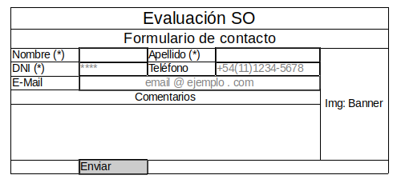

# HTML5 - Evaluación 2

Desarrolle una página HTML que genere un formulario dentro de una tabla respetando el formato de la siguiente imágen



## Validaciones

* Los campos con (*) son obligatorios
* Formato de email: ```[a-z0-9._%+-]+@[a-z0-9.-]+\.[a-z]{2,}$```
* Formato de teléfono: ```[\+]\d{2}[\(]\d{2}[\)]\d{4}[\-]\d{4}```
* Coloque el ejemplo de formato en ambos campos

## Entrega
* Generar un pull request a este directorio indicando claramente apellido de los alumnos.
